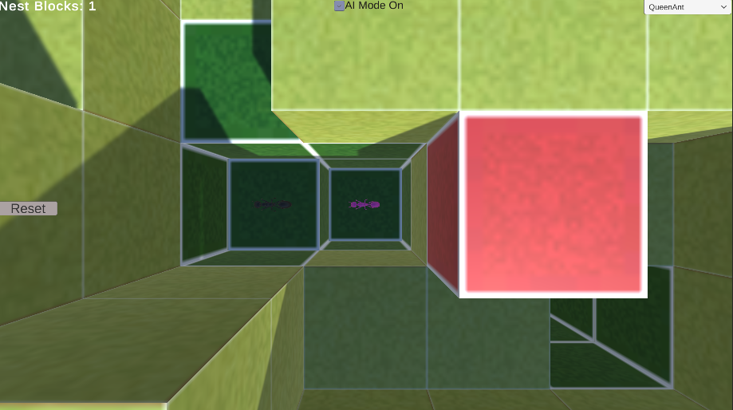
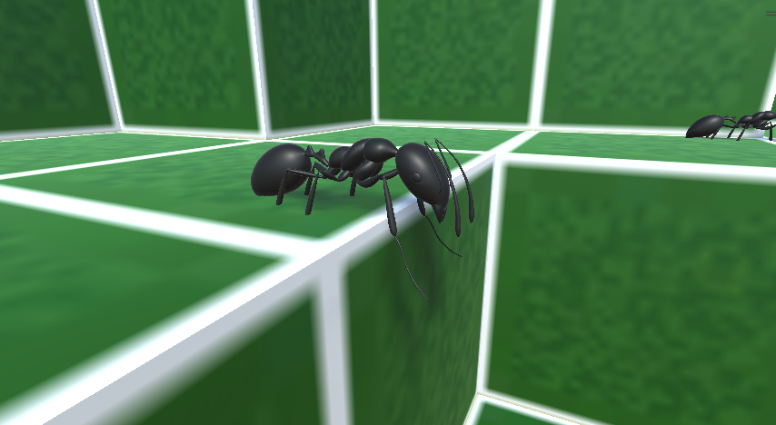
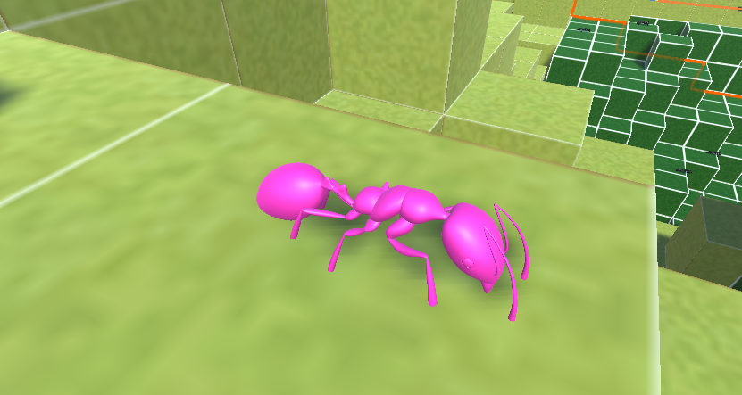
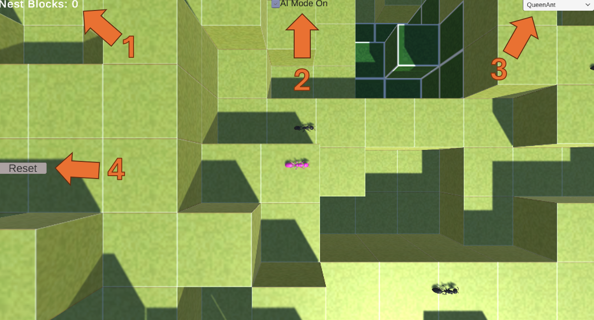
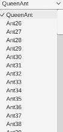

# Assignment 3 CPSC 565: Antymology
Made by Alec McLeod for CPSC 565 taught by Christian Jacob at University of Calgary
February 15th, 2026

# Overview

This is a simulation that is meant to capture ants using intelligent and cooperative behaviour in a generated world. The idea was to create ant behaviour and then add in a learning aspect of some kind. For this project, I chose to implement a neural network using the ML-Agents Unity package, so that over training, the ants could learn to cooperate with each other. This was done by each ant having their own copy of the same ant behaviour, so any behaviour seen was due to emergent systems, not a mastermind single AI. Ants receieve the important information into sensors and use that to choose actions, being trained on performance based on mostly the colony's overall fitness (how many nest blocks the queen produced), with a small contribution of personal fitness (amount of time alive, making efficient moves).

Unforuntately, the ants don't display much intelligent behaviour due to extreme limitations in terms of experience with the software and time to train. Hopefully the effort can be seen, because a lot really was put into this project. There are also MANY problems that I realized after training in terms of the agent files, like basic counting errors, caused by long work hours and dozens upon dozens of changes. While regularly this would be fixed, that is just not possible due to that requiring complete retraining and there not being time to do that, so please forgive the problems, I will point them out and own up to them as they appear. This report will attempt to be professional in the beginning, but as we dig deeper into mistakes that you only see when making a document like this, there will be more candid and less professional wording, I apologize.

IMPORTANT NOTE FOR LOOKING AT COMMITS: I kept my results from each training session and the metadata all in the github for the sake of keeping a record and because I kept losing things when crashes happened. Because of that, the insertions/deletions are very bloated, as there are tons of log files, model attempts, packages, recovery files, etc being added/deleted each time. So please don't think I actually wrote 5000 insertions myself, a single model file is 3000+ lines or if 30 files are changed, it was a lot of adding one thing meant I needed to modify another file, or change a variable in the prefab, then each one modifies the scene files, etc.

## Agents and Objects

### Blocks
There are various block types that will be spawned randomly at the start of each world generation. Grass blocks (light green) are the basic block type, and very common. Mulch blocks (green) can be eaten to regenerate health by ants. Acidic blocks (purple) cause ants to lose double the health per second. Container blocks (black) surround the world and cannot be dug into. Nest blocks (red) can be placed by the queen ant and are the goal of the colony to produce as many as possible.

### Ants

Black ants are the worker ants of the simulation. They are capable of eating mulch blocks, digging, walking/climbing and sharing health. Ants will lose health over time, and when their health reaches zero, they die. Ants can regenerate health by eating mulch blocks, which by default restore 20 health. Ants can climb up onto blocks that are less than 3 blocks above them. They will choose which action to pick based on their neural network (for more information, read AI section). Ants are capable of detecting the blocks under and a vertical line in front of them (-1, 2). They are also capable of knowing how many ants are in the same block, and their health. Also, in order to make informed decisions, worker ants always know both the direction and distance to the queen, as well as the status of her emergency signal.

### Queen Ant

There is only ever one queen ant, and she is capable of placing down nest blocks at a cost of 1/3 of her max health. She also has the ability to turn on/off an emergency signal, which was left up to the neural network when that should be utitlized for most efficient use. This is meant to simulate pheromones that ants release in order to call for help that causes them to swarm towards the queen. While by default she could do any of the same actions as ants, the ability to give health was removed from her agent behaviour since it wouldn't reasonably help the goal, and would only add noise.

## Running the Simulation

To play the scene, just press the play button on top of the unity screen. The ants will spawn above the world and fall down, then begin moving after a small period of time. The world by default will spawn with 100 ants (1 queen and 99 worker ants), but that and various parameters can be modified in the ConfigurationManager and WorldManager objects for advanced users. The camera will default to tracking the queen from above, but can be changed in the UI (see below).

## UI

### 1. Nest Block Count
This tracks the current nest blocks that have been placed by the queen ant in the current simulation.

### 2. AI Mode Toggle
This toggles whether the ants are using the AI trained behaviour or not. When on, the ants will operate based on the trained antbehaviour.onnx file. When turned off, the ants will choose a totally random behaviour.

### 3. Tracking Camera Selector

This selects which ant to track during gameplay from an above view. By default this will be tracking the queen, with the queen always on top. After spawning, the list will be populated, and as ants die, the list will repopulate to remove dead ants. In the dropdown, any ant can be selected and the camera will swap to viewing them from above.

### 4. Reset button
This will reset the world, generating a new world and spawning new ants. This has sometimes caused odd behaviours when it comes to the neural network response to things, if so

# Coding Decisions

## AI
AI was created and trained using the ML-Agents Unity package v4.0.2. The ants were programmed with the functions and variables being in separate files, and the AntAgent and QueenAntAgent being extensions of the ML-Agents class. Training occured over the course of 6 hours at 20x speed in a decreased world size with a decreased ant population of one queen ant and 4 worker ants in order to allow for quick respawning and training. For advanced users, there is a toggle placed in WorldManager.cs that allows for swapping on and off of certain training conditions (Singleton parameters, speed), but in order to train, some parameters have to be manually adjusted in the ConfigurationManager.cs file (see comments in file for specific changes).

There were a total of 12 training attempts made before there was a fitting training set that ran without difficulties. Limitations of the training CPU required for the smaller world size, otherwise world generation would take too long for the trainer to communicate with. Even after the change it still resulted in crashes after a period of time, however weights did appear to save for the last training set, which was used, but since it never ended training in a normal fashion, how much of the 6 hours was used is unknown. (For details and output of every training attempt, you can look in results.)

Overall, no complex behaviour was really seen much (likely do to many problems) but there is definitely an improvement from the beginning. It's unfortunate, because my training conditions are where you see the best behaviour (which is just a limitation of training vs testing size and the necessity of smaller samples to run many batches for training) where I physically saw them building stairs, going to the queen, rescuing the queen from a hole, etc. But the bigger world made it possibly more easy to ignore her or be unable to find her, and also the fact that the training ended on a crash with recovering the checkpoint means I don't actually know how much of that was saved in the last checkpoint, but I just couldn't run it anymore in terms of time and my hardware, so despite wanting to retry, I just couldn't.

Fair warning: From here it gets more rambly, if you want just specs, the top of each section is there, later paragraphs are explanations which for each section, eventually go into reflections which is the candid, rambly part.

### Neural Network Organization
The neural network settings used were based on recommendations for game AI training and modified based on time/run limitations in terms of training. For each agent type, decision making is based on a 3 layer network with an input size of 33, a hidden layer of 256, and an output layer of 7. More specifics on the network settings and every training parameter can be found in AntAgent_config.yaml but note that there may be many mistakes. An attempt was made.

### Inputs
Overall, the inputs were vectors that contained important information that allowed ants to make decisions. Very little guidance was given in terms of what was important for these, instead just leaving it up to the AI to determine what combinations could provide useful knowledge.

#### Worker Ants Input
The worker ants receive an input vector with a size of 33, which is just wrong, it should be of size 28, the size wasn't properly reduced after removing other block detection, which is entirely my own fault. As the 28 that are there, they can be broken down as follows:
1. Health (normalized by max health)
2. Distance to queen (normalized by /1000 which I'm only just seeing, that should've also been changed to 100)
3. Block under type (one-hot encoded)
4. Can move forward (boolean)
5. Queen emergency signal (boolean)
6. Direction to queen (3 values to make a vector, x, y, z)
7. An array of ants in the block and their health, organized in such a way where the first is a bool to exist, and the second is each's normalized health. This takes up 20 spaces as there is a limit of 10 monitored (chosen at random) and the rest is padded as zeroes.

The idea of the inputs was that different combinations of information could provide important knowledge. It was a difficult balance between trying to give enough useful information without it being too messy given the time constraints for training. For example, Direction to nearest worker ant could've also been added, the total number of other worker ants still alive, or other block types around the ant. Some knowledge is also blatantly missing that should've been added, such as the current x,y,z coordinates, the current rotation, etc. that were already in the Ant file, but were just missed overall.

Some of the connections between inputs turning into knowledge could be simple, but the chosen inputs also allowed for potential training that caused more complex behavioural choices to be made. For some examples from most basic to most complex:
- if it is not possible to move forward, rotate before trying to move
- if health is low and the block under is mulch, eat the mulch, unless the ants in block shows other ants in the same block
- if another ant is in the same block with low health and the current ant has high health, share health with the ant to keep the both alive
- if distance to queen is too great, move closer to the queen
- if the block under is acidic, then it would be more beneficial to move forward, or dig up that block to remove it, maybe chosen based on how many other ants are on the block 
- the combination of the queen's emergency signal being on, the queen being nearby, and the ant's health being high would hopefully encourage the ant to move to the queen (based on direction given) and give her health (swarm when nearby)
- if the queen's emergency signal is on but the queen is far away and there are other conditions that indicate problems (acidic blocks underneath, low health) then prioritize self first (avoid swarming everyone and lose efficiency)

#### Queen Ant Input
The queen ant received less total information, only getting a vector in of what is listed as 13 but should be 8 (unless I genuinely am miscounting something here, both are 5 under). This is broken down into:
1. Health (normalized by max health)
2. Distance to nearest worker ant (properly normalized by /100)
3. The type of the block in front (one-hot encoded)
4. Whether a nest block can be places (bool)
5. Number of ants in the same block (normalized by /10)
6. Nest blocks placed this episode/run (normalized by /100 but should've been /10)
7. Emergency signal status (bool)
8. Number of worker ants alive (normalized by /100)

There is multiple HUGE gaps here, I had originally had it where her was supposed to be that slot 3 was the block below, same as the worker ants, but when meaning to add a new sensor for the one in front, instead I overwrote the block below sensor, which explains a lot of bad behaviour. Also, she doesn't properly have the can move one, when that was also supposed to be added and I removed it (I was writing the agent files after so much work bug fixing and clearly it ruined my quality of work and when trying to get the training to work, I just wanted to let it go so I could sleep).

As for some of the intentional removals, the focus was for the queen to remain more selfish (not checking the health of all the ants in the block) so that more of her focus could be on nest blocks placed. Some removals are also obvious, like removing distance to queen and direction. She doesn't know the direction to the nearest worker, because the idea is that she should be more focused on using her emergency signal to make them come, and instead just avoiding moving too far from the nearest worker.

### Outputs
The outputs were a vector as well, of different actions that varied in size between the worker and queen.

#### Worker Ant Outputs
The worker ants could choose between the following actions:
1. Do nothing
2. Attempt to move forward
3. Rotate right
4. Rotate left
5. Attempt to eat mulch
6. Attempt to dig block
7. Give health to the lowest health in block

Some of these are attempts, because it was meant to be something they would learn overall as a strong input/output connection. To begin with, they could alway try to eat mulch, but since since can eat mulch isn't given as an input, they'd have to learn that they shouldn't try unless there's mulch below the ant. Similar to the connection between can move forward and trying to move forward, learning that 2 only works if that is set to true. To make things simple, the choice to make it so giving health is just to the lowest health was made, though it was highly considered making it so queen was prioritized, that just didn't have time to be added and properly bug tested.

#### Queen Ant Outputs
The queen ant has 9 different output options. The first six are the same as the worker ants, but the last 3 are as follows:
7. Turn on emergency signal
8. Turn off emergency singal
9. Attempt to place a nest block

### Rewards
The rewards overall were pretty light in terms of the ants individual actions, which definitely should've been modified strongly upon reflection. To first reflect on what was there, in the agent code itself:
- Biggest reward overall for queen is per nest block placed (+2 per block), calculated at the end of the episode. This was coded originally to be larger if there was a large number of blocks placed (>10) but after some testing, I should've changed that to just be a bigger reward for every individual nest block early on, because none ever got to that many with the training and code I had.
- Penalty for dying (-1), extra penalty for dying by falling off the world (-1 on top) (this was added because after so much bug testing, the ants would still fall through the world sometimes, so I decided to accept it and leave it to the AI to figure out what combinations might lead to that more often)
- Reward per decision point that they live, which is 0.01 for the queen and 0.005 for workers to more encourage selfish behaviour from the queen.
- Tiny tiny penalty for moving (-0.002) because that's always recommended to encourage efficiency

In the episode manager (so used for training):
- Whenever a nest block is placed, all currently surviving ants get a reward (0.2) to connect to the workers a reward that they would hopefully eventually connection to queen health and other factors
- There was also accidentally redundancy I realize by giving extra rewards for total nest blocks *0.5, which isn't the best given the other parts too but this one does apply to both

There are some things I meant to add that I guess I just totally forgot since as soon as I made the agent and added it, stuff began breaking in terms of things falling so much more and completely having to redo all my movement (that took 4 hours at least). 

Now to reflect on what should've been changed to make things a LOT better that I just didn't do, I should've added a lot more negative rewards for trying to do redundant things/things that didn't work. I didn't properly punish trying to eat a block that isn't a mulch block, trying to move forward when it wasn't possible, the queen trying to turn on the signal when it's already on, etc. that could've done a TON for removing improper behaviour from happening. There also should've been possibly a small reward to worker ants for being closer to the queen ant (normalize the distance and multiply by 0.01 for reward) to get them to not just wander off. Overall, it's very obvious that I had too much faith in the idea that having a neural network would make something "intelligent", and my exhaustion had been getting to me, so I forgot the importance that evolution doesn't just "happen", it can require a lot more fine-tuning in terms of making certain behaviours better. 

### VERY Important Note
The training for the ants has an incredible limitation that was only noticed after everything was done. In order to attempt to create cooperative behaviour, the ants were trained at the same time. However, improperly the QueenAntAgent was not configured to have the same size of input vector and output vector as the other ants. The input vector, since smaller than the .onnx file should be alright as the vector is just filling spots with zeroes, but the queen ant might be missing or have strange behaviours since the output of the last was seemingly 7, when she has 9 total behaviours. This leads to further black box problems, but it is certain that the way it was organized did NOT result in her last behaviours being cut off completely, since her 9th behaviour is to place down nest blocks, and that is viewed as a behaviour that occurs when the intelligent behaviour is turned on. Given the configurations, it is also possible that despite the warnings, there is properly two sets of behaviours with two different input/output sizes actually being used, and the warning is just because it checks based only on the first behaviour set.

## Some overall reflections
Completely uncessary part, feel free to ignore.

It's so clear that I could've done so much better with this, though I do acknowledge my lack of experience in unity and not being a computer science major did a ton. When I was coding the agents, it is so clear to me looking at it that my frustration had just piled up, I had been coding for 13 hours straight just bug fixing and going back and trying new suggestions from forums and coding guides and youtube videos and everything and then trying and having things still be broken. (Look at the github commit messages for some of the story.) I'm lucky that my honours thesis involves working with conda and setting up environments all the time or I think I would've just given up once I got to actually making the ML-Agents part.

I knew from the beginning I wanted to do a neural network, but since I had to spend so much time just figuring out unity and 3D physics, model importing, UI, etc., I didn't get to think about how I actually would do that until I had nearly finished my Ant file. If I knew I was gonna use ML-Agents first and how that worked, I could've better planned my input/output vectors and not made those mistakes. Since I didn't know how to code a controller and didn't want to use more time learning that, I couldn't bug test my functions until I set up the random part to just random move, and then there was the issue that it was hard to tell if the agent part messed up or if it was functions (sooooo many debug logs added that I commented out not including the ones still there). That meant basically redoing them all, which definitely... sucked, and was basically the point when my code went from being something I understood and typed out entirely myself to something I had to run from tutorial to tutorial to grab and frankenstein together until I got something that worked (which created a lot of need to remove redundancy way later).

I'm typically pretty good at finding small bugs or logic issues, but a lot of these issues that were popping up were interactions between classes that I had just never had to work with before. Not to mention that the more of a code isn't purely yours (not in the way that I don't understand it/wasn't making decisions/only copy+paste/let AI write it all, but moreso relying on googling how to do a thing I wanted to do in unity, or copying how a tutorial said to make objects move, or getting recommended values for a function because I haven't worked with it), the easier it is for inconsistencies to pile up. Even my commenting fell apart, which is usually a very strict, well-maintained consistency thing I like to keep. I don't regret going the direction I did, but it's clear there might've been easier ways to do things, like hard coding a lot of decisions and then just leaving smaller parts to AI, or just having probability values that are basic to modify over time. 

I think I definitely learned a lot myself. I feel pretty confident on making/training a model now in unity (though I did already have some experience in making an NN and training it), but the movement stuff? I still can't tell if it actually works all the way. There are many bugs (haha) still I know, but it was hard, and this was my first time ever doing something in a 3D physics environment like this, or using a game engine, so I'm still proud of myself for how hard I tried. 

## Additional credits
Original antymology file made by Davies Cooper https://github.com/DaviesCooper/Antymology

Ant model by printable-models on Free3D https://free3d.com/3d-model/ant-v1--714598.html